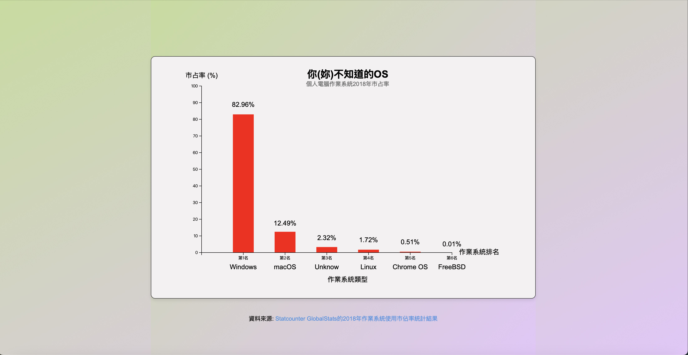
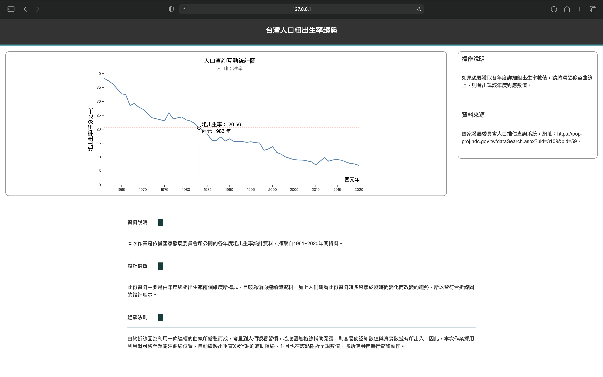

# D3.js - Data and information visualization

**作品名稱：** D3.js的練習

**動機：** 這些作品是我在修讀資料視覺化課程時完成的作業。

**目的：** 在學習過程中，教授為了幫助我們更深入地理解MIPS指令集的格式(即機械語言的呈現方式)以及組合語言的運作原理，從而掌握CPU數位電路設計的核心概念，特別安排了以下幾題練習。

**使用語言：** HTML、CSS、JavaScript

**繪圖套件：** D3.js (v7)

**開發IDE：** Visual Studio Code

**操作說明：** 開啟網頁方式有兩種，其一為將檔案放置於網頁伺服器中，透過瀏覽器觀看。另一種為，在Visual Studio Code安裝Live Server來開啟。(若直接點選*.htm檔，D3.js是不會運作的)

**題目解說：** 作業主要有四個，分別如下：
1. HW_1.html：根據2018年個人電腦作業系統的市場佔比，本圖將以直條圖的方式進行呈現。使用D3.js繪圖工具，逐一刻劃每一個元件。(若引用的數據有誤，敬請見諒。)

 

	

 

2. HW_2.html：擷取自1961~2020年間，國家發展委員會所公開的各年度粗出生率統計資料(Data1.csv)，所繪製的折線圖。使用者可透過鼠標點選，協助使用者進行查詢動作。此繪圖，有參考Stack Overflow的相關貼文，但因年代久遠，不確定準確文章，[D3.js: Wrong position of horizontal and vertical focus lines (crosshairs) in line chart](https://stackoverflow.com/questions/40527481/d3-js-wrong-position-of-horizontal-and-vertical-focus-lines-crosshairs-in-lin)爲相似資源。

 

	

 

3. HW_3.html：這份作業是以兩人為一組的小組合作進行。在此次作業的分工中，我們決定由每人各自負責繪製一張圖表來完成專案，而我負責的是以下呈現這張圖所呈現的圖表。擷取自1961~2021年間，從環保署的公開資料(Data2.csv)。廚餘回收量的統計數據實際上受到時間變化、地域差異及回收方式等多重因素的影響。若希望在一張圖表中呈現這些多維度資料，無疑是一項挑戰。因此，本人使用了一種能夠展示時間變化趨勢的動態長條圖，並透過橫軸的離散資料來區分不同地域，同時利用圓球顏色的差異來呈現各種回收類型。這樣的設計旨在將多重資訊集中於同一圖表中，幫助讀者更深入理解資料背後所蘊含的重要訊息。此繪圖，基於[Most basic lollipop chart in d3.js](https://d3-graph-gallery.com/graph/lollipop_basic.html)資源，修改而成。

 

	

 
   
**致謝：** 在學習D3.js的過程中，我對許多語法尚不熟悉，並且在遇到困難時，仰賴了許多網路上的資源與教學，如D3.js官方網站、Stack Overflow等的解答與指引，才能順利完成各次作業。
