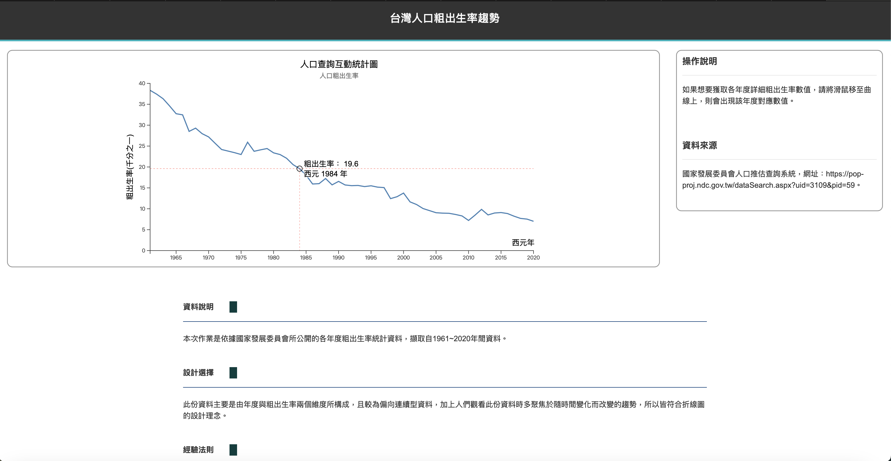

# D3.js - Data and information visualization

**一、作品名稱：** D3.js的練習

**二、動機：** 這些作品是我在修讀資料視覺化課程時，所完成的作業。

**三、目的：** 在學習過程中，為了幫助我們更深入地理解如何選擇合適的視覺呈現方式來有效傳遞不同類型的資訊，教授引導我們探討最佳的媒體呈現方法。為此，教授選用了具有高度擴展性的D3.js套件，創造出既直觀又具高度信息傳遞能力的圖表，幫助我們牢牢掌握資料視覺化的核心理念。為了進一步深化學習，教授特別安排了以下幾道練習。

**四、使用語言：** HTML、CSS、JavaScript

**五、繪圖套件：** D3.js (v7)

**六、開發IDE：** Visual Studio Code

**七、操作說明：** 開啟網頁方式有許多，在此介紹常見的兩種方式。其一為將檔案放置於網頁伺服器中，透過瀏覽器觀看。另一種為，在Visual Studio Code安裝Live Server來開啟。(若直接點選*.htm檔，D3.js是不會運作的)

**八、題目解說：** 作業主要有三個，分別如下：
1. HW_1.html：根據2018年個人電腦作業系統的市場佔比，本圖將以直條圖的方式進行呈現。使用D3.js繪圖工具，逐一刻劃每一個元件。(若引用的數據有誤，敬請見諒。)

 

	

 

2. HW_2.html：擷取自1961~2020年間，國家發展委員會所公開的各年度粗出生率統計資料(Data1.csv)，所繪製的折線圖。使用者可透過鼠標點選，協助使用者進行查詢動作。此繪圖，有參考Stack Overflow的相關貼文，但因年代久遠，不確定當時引用貼文，與[D3.js: Wrong position of horizontal and vertical focus lines (crosshairs) in line chart](https://stackoverflow.com/questions/40527481/d3-js-wrong-position-of-horizontal-and-vertical-focus-lines-crosshairs-in-lin)爲之相似資源。

 

	

 

3. HW_3.html：這份作業是以兩人為一組的小組合作進行。在此次作業的分工中，我們決定由每人各自負責繪製一張圖表來完成此專案，而我負責的是以下呈現這張圖所呈現的圖表。擷取自1961~2021年間，從環保署的公開資料(Data2.csv)。廚餘回收量的統計數據實際上受到時間變化、地域差異及回收方式等多重因素的影響。若希望在一張圖表中呈現這些多維度資料，無疑是一項挑戰。因此，本人使用了一種能夠展示時間變化趨勢的動態長條圖，並透過橫軸的離散資料來區分不同地域，同時利用圓球顏色的差異來呈現各種回收類型。這樣的設計旨在將多重資訊集中於同一圖表中，幫助讀者更深入理解資料背後所蘊含的重要訊息。此繪圖，基於[Most basic lollipop chart in d3.js](https://d3-graph-gallery.com/graph/lollipop_basic.html)資源，修改而成。

 

	

 
   
**九、致謝：** 在學習D3.js的過程中，我對許多語法尚不熟悉，並且在遇到困難時，仰賴了許多網路上的資源與教學，如D3.js官方網站、Stack Overflow等的解答與指引，才能順利完成各次作業。
